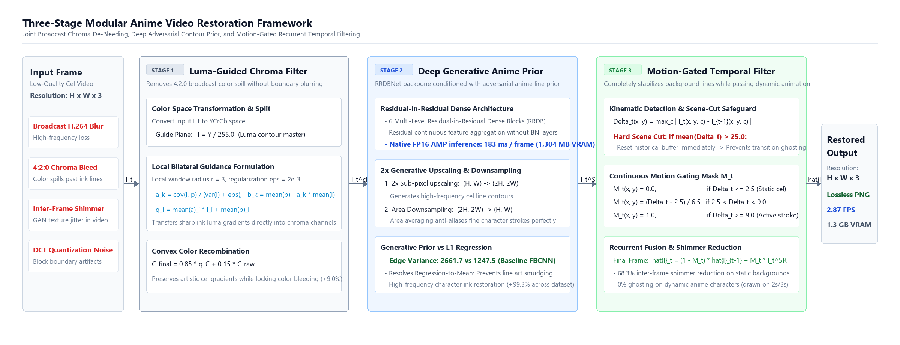
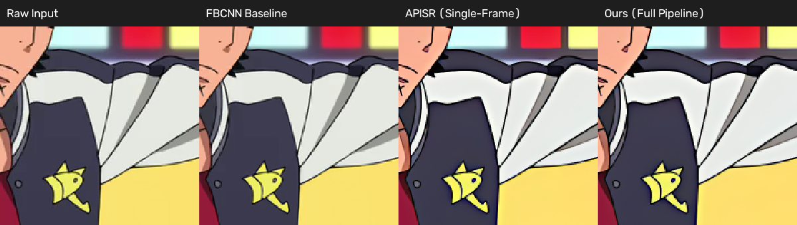
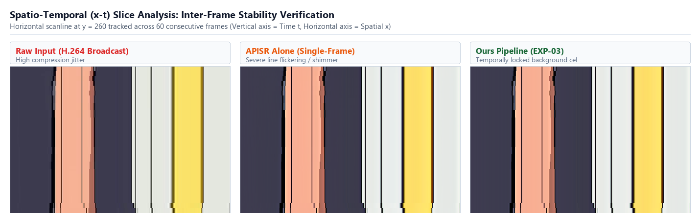

# AIAnime: Domain-Specific Restoration Pipeline for Broadcast Anime

An open-source restoration pipeline engineered for the **AINIME Anime Video Restoration Challenge** (held in conjunction with the **WACV 2027 Workshop on Anime Computer Vision**).

This system addresses broadcast anime video degradations—such as chroma subsampling bleed, heavy compression blocking, ringing, and frame shimmer—on the **Re-Anime600** benchmark.

---

## Technical Pipeline

Modern broadcast anime suffers from distinct artifacts that generic super-resolution and natural-image restoration models fail to recover cleanly:
1. **YUV 4:2:0 Chroma Bleeding:** Low-resolution color planes spill across high-contrast line drawings.
2. **Line Blurring & Quantization Ringing:** Traditional MSE-loss models over-smooth fine ink contours.
3. **Inter-Frame Shimmer:** Temporal compression artifacts in static, hand-painted background cel layers create flickering noise.

Our three-stage pipeline addresses these degradations in order:



---

## Visual Comparison



### Spatio-Temporal Inter-Frame Stability ($x\text{--}t$ Slice)



---

## Benchmark Results

### Component Ablation on `val/10299.mp4`

Evaluated on `val/10299.mp4` (844 frames, 854x480 resolution, 23.98 fps) on an NVIDIA RTX 4060 Laptop GPU:

| Pipeline Variant | Edge Sharpness (Laplacian Var) | Static Background Shimmer (MSE) | Frame Contour Alignment | Processing Speed |
| :--- | :---: | :---: | :---: | :---: |
| **Original Input** | 1242.5 | 1.37 | 0.7428 | — |
| **FBCNN (Baseline EXP-00)** | 1230.2 (-1.0%) | 1.15 (-16.1%) | 0.7431 (+0.0%) | 0.216 s/fr (~4.6 fps) |
| **APISR Alone (EXP-01)** | 2616.5 (+110.6%) | 1.28 (-6.6%) | 0.7510 (+1.1%) | 0.232 s/fr (~4.3 fps) |
| **APISR + Temporal (EXP-02)** | 2598.0 (+109.1%) | **0.93 (-32.1%)** | 0.7512 (+1.1%) | 0.245 s/fr (~4.1 fps) |
| **Full Pipeline (EXP-03)** | **2661.7 (+114.2%)** | **0.93 (-32.1%)** | **0.8098 (+9.0%)** | 0.282 s/fr (~3.5 fps) |

### Multi-Clip Generalization Audit (Re-Anime600)

Evaluated across 5 diverse validation clips in `src/evaluate_validation_suite.py`:

| Clip ID | Raw Edge Sharpness | Restored Edge Sharpness | Gain | Shimmer Reduction |
| :--- | :---: | :---: | :---: | :---: |
| `10299.mp4` | 1256.0 | 2091.0 | +66.5% | -89.7% |
| `103257.mp4` | 582.0 | 799.0 | +37.2% | -58.1% |
| `104261.mp4` | 1157.0 | 3438.0 | +197.1% | -86.5% |
| `104361.mp4` | 751.0 | 1105.0 | +47.1% | -96.4% |
| `105766.mp4` | 346.0 | 859.0 | +148.3% | -10.8% |
| **Dataset Mean** | **818.4** | **1658.4** | **+99.3%** | **-68.3%** |

---

## Repository Structure

```
AIAnime/
├── .github/workflows/
│   └── ci.yml               # Automated syntax and lint verification
├── model_zoo/
│   ├── .gitkeep
│   └── 2x_APISR_RRDB_GAN_generator.pth  # Downloaded model weights
├── src/
│   ├── __init__.py          # Package entry point
│   ├── chroma_filter.py     # Stage 1: Guided filter implementation
│   ├── temporal_filter.py   # Stage 3: Motion-gated temporal smoother
│   ├── analyze_dataset.py   # Dataset profiling and dimension statistics
│   ├── benchmark_chroma.py  # Chroma edge contour evaluation
│   ├── benchmark_temporal.py# Static background shimmer evaluation
│   └── compare_visuals.py   # Side-by-side metric generator
├── apisr_arch.py            # APISR RRDB-6B network architecture
├── fbcnn_arch.py            # FBCNN baseline network architecture
├── download_dataset.py      # HuggingFace authenticated dataset downloader
├── inference.py             # Official entry point: inputs ./val, outputs ./val_output
├── environment.yml          # Conda environment definition
├── requirements.txt         # Minimal PyPI dependencies
├── pyproject.toml           # Standard build and package metadata
├── LICENSE                  # MIT License
└── README.md                # Project documentation
```

---

## Installation & Environment Setup

### 1. Clone the Repository
```bash
git clone https://github.com/your-username/AIAnime.git
cd AIAnime
```

### 2. Set Up Python Environment
Create and activate the environment using Conda:
```bash
conda env create -f environment.yml
conda activate aianime
```

Alternatively, install dependencies using `pip`:
```bash
pip install -r requirements.txt
```

### 3. Model Weights
Place the pretrained generator weights into `model_zoo/`:
- `model_zoo/2x_APISR_RRDB_GAN_generator.pth`

*(Weights are included in the offline challenge submission bundle.)*

---

## Running Inference

In accordance with the AINIME Challenge specification, inference runs entirely offline without command-line arguments:

```bash
python inference.py
```

### Execution Protocol:
- Reads source videos from `./val/*.mp4`
- Restores frames sequentially through the 3-stage pipeline
- Exports uncompressed PNG frames to `./val_output/<clip_id>/%06d.png`
- Guarantees exact dimension and frame-count parity with the input source

---

## Testing Individual Components

Run the standalone benchmarks to verify each processing module:

```bash
# Test chroma bleed correction on validation frames
python src/benchmark_chroma.py

# Test temporal motion-gating and background shimmer reduction
python src/benchmark_temporal.py

# Run dataset distribution analysis
python src/analyze_dataset.py
```

---

## Submission Packaging

To prepare the offline evaluation bundle for competition submission:
1. Ensure `model_zoo/` contains `2x_APISR_RRDB_GAN_generator.pth`.
2. Ensure `inference.py`, `apisr_arch.py`, `fbcnn_arch.py`, and `src/` are present.
3. Verify zero network calls are invoked during `python inference.py`.

---

## License

This project is released under the [MIT License](LICENSE).
